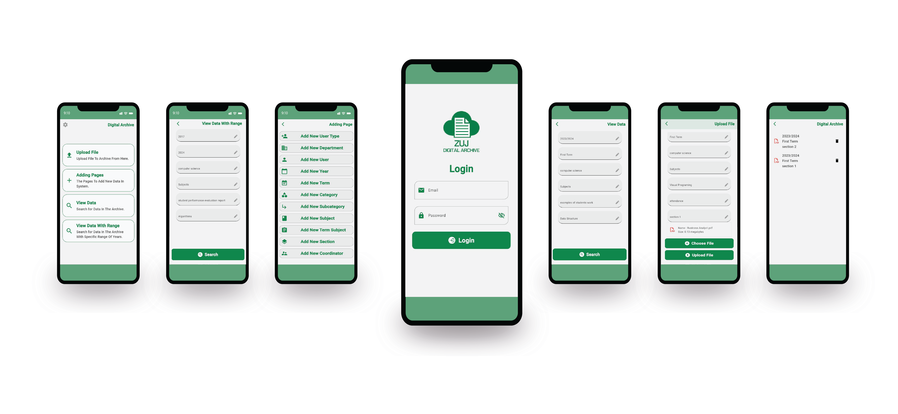

# Digital Archive

Welcome to the Digital Archive Apps Repository! This application is designed to help you manage your archived files efficiently with a beautiful and easy-to-use interface.

## Features

- **Intuitive & User-Friendly Interface:** Experience effortless navigation with a clear and beautifully designed UI.

- **Secure Authentication:** Firebase authentication ensures the security of your data, with Google Sign-In for easy access.

- **Seamless File Uploads:** Enjoy a hassle-free process for uploading your files with just a few simple steps.

- **Dynamic Data Management:** Easily add data in real-time to keep your information current and organized.

- **Effortless File Viewing:** Quickly access and view your files with a streamlined and efficient interface.

- **Dark & Light Themes:** Switch between dark and light themes to match your preference and enhance your viewing experience in different lighting conditions.

- **Arabic & English Support:** Use the app in your preferred language with full support for both Arabic and English, ensuring a comfortable and accessible user experience.

## Demo

## Installation

1. Clone this repository using `git clone https://github.com/anasAlmadmouj/archive_app
2. Navigate to the project directory: `cd archive_app`
3. Install dependencies: `flutter pub get`
4. **Add `google-services.json`:** For Firebase setup, each developer needs to add their own `google-services.json` file obtained from their Firebase project. Place this file in the `android/app` directory.
5. Run the app: `flutter run`

## Dependencies

This app utilizes the following dependencies:

- **shared_preferences:** Facilitates data persistence by allowing you to store simple key-value pairs on the device.

- **bloc:** Provides a powerful and flexible state management solution for your Flutter app, enhancing code organization and UI updates.

- **flutter_bloc:** Integrates the BLoC (Business Logic Component) pattern seamlessly into your Flutter app, streamlining state management and UI interactions.

- **conditional_builder_null_safety:** Enables conditional widget building with null safety, optimizing your UI rendering based on various conditions.

- **uuid:** Generates unique identifiers (UUIDs) for your data, ensuring distinct and reliable identifiers for your app’s entities.

- **firebase_storage:** Offers integration with Firebase Storage for uploading and managing user files in the cloud securely.

- **firebase_core:** Essential for initializing and connecting your Flutter app with Firebase services, ensuring smooth integration.

- **firebase_auth:** Enables comprehensive user authentication using various methods, enhancing the security of your app.

- **cloud_firestore:** Integrates with Firebase Firestore for real-time database functionalities, enabling efficient data synchronization and storage.

- **file_picker:** Enables comprehensive file picking functionalities, allowing users to select various file types from the device.

- **url_launcher:** Facilitates launching URLs in the default browser, making it easy to navigate to web content from your app.

- **const_date_time: ^1.1.0:** Ensures constant date and time values, simplifying date-time manipulation and consistency in your app.

- **font_awesome_flutter:** Grants access to an extensive library of FontAwesome icons to enhance the visual appeal of your app.

- **flutter_screenutil:** Provides responsive screen size and adaptation utilities, ensuring a consistent and optimized UI across different devices.

- **syncfusion_flutter_pdfviewer:** Enables robust PDF viewing capabilities, allowing users to view and interact with PDF documents seamlessly.

- **flutter_localization:** Supports internationalization and localization, making your app accessible to users from various regions with different languages.

---

### Designed and developed with by [Anas Almadmouj](https://www.linkedin.com/in/anas-al-madmouj-0979271aa/).
